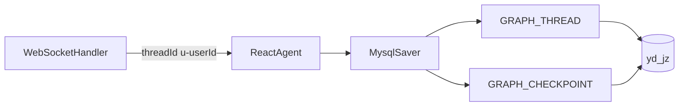

# MySQL 持久化每个用户的对话记忆

> **实施约定**：本 plan 仅设计；在**下一个特性分支**实现，不在写 plan 的会话中改代码。

## 已确认方向（2026-07-14）

| 项 | 结论 |
|----|------|
| 存哪 | **本库 MySQL `yd_jz`**，用框架 `MysqlSaver` |
| 不选 Redis/文件/Mongo | 已有 MySQL；单机/Pi 部署足够；避免新基础设施 |
| 用户分区键 | 继续 `threadId = u-{userId}`（与鉴权/AuthContext 一致） |
| 本阶段目标 | Agent **运行记忆**跨重启可恢复 |
| 本阶段不做 | 多会话房间、前端可见历史列表、向量长期记忆 |

---

## 1. 背景与目标

### 现状

- `EasyAccountsAgentConfig` 使用 `new MemorySaver()`（进程内存）
- WS 聊天传入 `RunnableConfig.threadId("u-" + userId)`，用户间已隔离
- **重启服务 / Redeploy 后对话上下文全部丢失**
- 同一用户只有一条会话链（符合当前产品）

### 目标

1. 对话 checkpoint 落 MySQL，重启后同用户可续聊
2. 继续按用户隔离，不串上下文
3. 改动最小化：优先框架自带 `MysqlSaver`，不自研序列化管道

### 非目标（另开迭代）

- 多会话：`u-{userId}-c-{conversationId}` + 「新建对话 / 切换会话」API
- 产品可见历史：自建 `chat_message`（user/assistant 文本）供 UI 列表/导出
- Redis 热缓存、跨机房同步
- 语义检索 / RAG 长期记忆

---

## 2. 方案选择



| 方案 | 结论 |
|------|------|
| **MysqlSaver（采用）** | 与现有 DataSource / 用户 threadId 对齐；框架已提供表结构与 CRUD |
| RedisSaver | 需引入 Redis；更适合短会话热数据，非首选 |
| FileSystemSaver | 容器/多实例不友好 |
| 自建 chat 表喂 Prompt | 灵活但工作量大，本阶段不必 |

两层模型（后续可选）：

1. **运行记忆（本迭代）**：`MysqlSaver` checkpoint —— Agent 续聊依赖
2. **可见历史（以后）**：`chat_message` 文本表 —— UI / 审计；不替代 checkpoint

---

## 3. 框架能力要点（MysqlSaver）

依赖已有：`spring-ai-alibaba-agent-framework` / `graph-core` 含：

- `com.alibaba.cloud.ai.graph.checkpoint.savers.mysql.MysqlSaver`
- `CreateOption`：`CREATE_NONE` | `CREATE_IF_NOT_EXISTS` | `CREATE_OR_REPLACE`

Builder 大致用法：

```java
MysqlSaver.builder()
    .dataSource(dataSource)
    .createOption(CreateOption.CREATE_IF_NOT_EXISTS)
    .build();
```

库表由 saver 管理（名称以框架为准，实现时再核对常量）：

- `GRAPH_THREAD`：按 `thread_name`（即 RunnableConfig 的 threadId）关联会话；含 `is_released` 等
- `GRAPH_CHECKPOINT`：checkpoint 状态（框架将 state 序列化为 JSON 内 base64 `binaryPayload`）

建议：

- 开发/首次部署：`CREATE_IF_NOT_EXISTS`
- 生产若希望 DDL 与应用解耦：运维先建表 + `CREATE_NONE`（实现时二选一写进配置）

---

## 4. 实现步骤（下一特性分支）

### 4.1 接线 MysqlSaver

**文件**：`EasyAccountsAgentConfig.java`

- 注入现有 `javax.sql.DataSource`（与业务库同一 `yd_jz` 即可）
- `.saver(MysqlSaver.builder()...)` 替换 `new MemorySaver()`
- Bean 生命周期：saver 随 Agent 单例创建即可

### 4.2 保持 threadId 约定

**文件**：`WebSocketHandler.java`（预期无需改逻辑）

- 继续 `ws.threadId = "u-" + user.getId()`
- 继续 `.threadId(ws.threadId)` + `metadata.userId`
- 文档写明：**一用户一条持久会话链**；清记忆 = 释放/删除该 thread 的 checkpoint（可用 saver API 或 SQL）

### 4.3 运维与膨胀控制

Checkpoint 含完整图状态，会随轮次增长。实现分支至少定一版策略（可先文档、后脚本）：

| 策略 | 说明 |
|------|------|
| 按用户「新开对话」 | 调用释放 thread / 删 `GRAPH_CHECKPOINT`（API 可后置） |
| TTL 清理 | 定时删 `saved_at` 过旧的 checkpoint（如 30 天） |
| 单用户踢号 | 与现有单端登录无关；记忆按 userId 保留即可 |

可选：`scripts/` 下增加清理 SQL 示例（不强制自动化）。

### 4.4 配置（可选增强）

`application.yml` 增加开关，便于本地仍用内存：

```yaml
easyaccounts:
  agent:
    checkpoint:
      type: mysql   # mysql | memory
      create-option: CREATE_IF_NOT_EXISTS
```

非必须；也可硬切 MysqlSaver 降低复杂度。

### 4.5 验证清单

1. 用户 A 聊两轮 → 重启应用 → 再聊，模型仍记得上一轮要点  
2. 用户 B 同时/先后聊天，上下文不出现 A 的内容  
3. DB 中 `GRAPH_THREAD.thread_name` 出现 `u-{id}`，且有对应 checkpoint 行  
4. 工具调用（listAccounts 等）在鉴权修复（StateAware）前提下仍正常  

### 4.6 文档

- `docs/easyaccounts-agent-usage.md`：记忆跨重启、按用户一条链、如何清记忆（SQL/后续 API）
- `deploy/README.md`：部署后自动建表或手工 DDL 说明；磁盘/库容量注意 checkpoint 体积

---

## 5. 风险与注意

- **状态体积**：长对话 checkpoint 变大 → 延迟与库容；需要清理策略  
- **序列化版本**：升级 `spring-ai-alibaba` 后旧 checkpoint 可能不兼容 → 大版本升级前可清空 GRAPH_* 或做迁移验证  
- **同库耦合**：checkpoint 与业务表同库，备份简单；若以后要独立扩展再拆库  
- **多实例**：MysqlSaver 可跨实例共享记忆；当前单机部署无此顾虑，属额外收益  
- **前置依赖**：工具侧 AuthContext 须已可用（StateAware 修复合并部署后），否则续聊仍会因「缺用户上下文」失败（与记忆存储无关）

---

## 6. 后续迭代（仅记录，本 plan 不实施）

1. **多会话**：`threadId = u-{userId}-c-{uuid}`；API：列表 / 新建 / 切换 / 删除会话  
2. **可见历史表**：`chat_message(user_id, conversation_id, role, content, created_at)`，WS 落库文本；与 checkpoint 并存  
3. **清记忆 API**：`DELETE /api/chat/memory` 或 release thread，供前端「清空对话」  
4. **若 QPS/延迟成瓶颈**：再评估 RedisSaver 作热层 + MySQL 冷备（非现在）

---

## 7. 建议分支与验收

- 特性分支名示例：`cursor/persist-chat-memory-mysql-50ba`（以当时规范为准）
- Base：`master`（含登录隔离 + Auth 工具线程修复）
- 验收：重启续聊 + 跨用户隔离 + 文档齐全；无前端历史 UI 要求

---

## 8. 关键文件（实现时）

| 路径 | 变更 |
|------|------|
| `agent/EasyAccountsAgentConfig.java` | MemorySaver → MysqlSaver |
| `controller/WebSocketHandler.java` | 通常不变（确认 threadId） |
| `application.yml` / `AuthProperties` 风格配置类 | 可选开关 |
| `scripts/*checkpoint*.sql` | 可选清理/说明 DDL |
| `docs/easyaccounts-agent-usage.md`、`deploy/README.md` | 行为与运维 |

**本会话不修改上述业务代码，仅落地本 plan 文件。**
