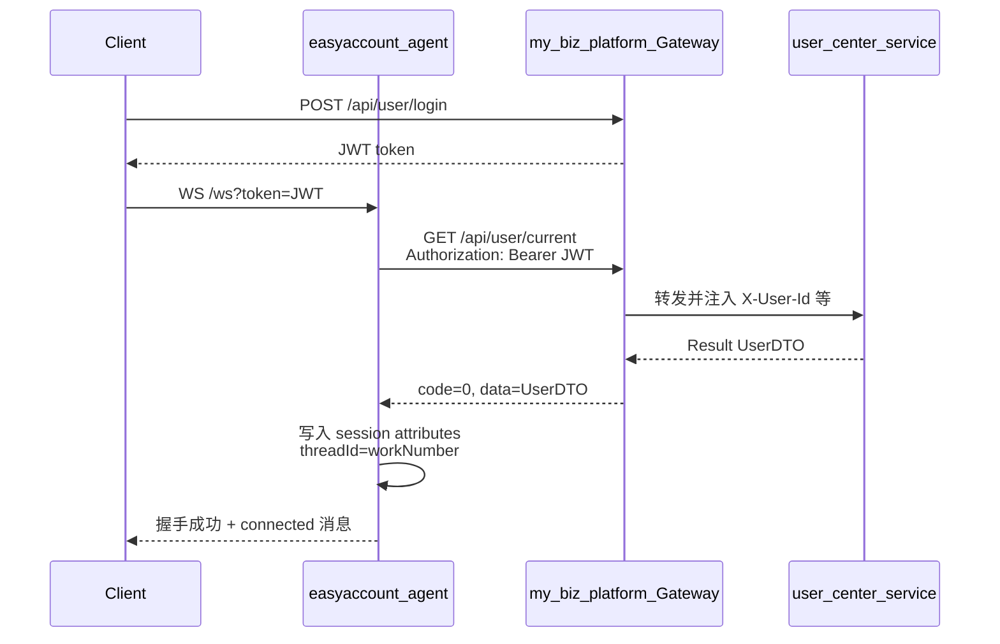

# WebSocket 聊天登录鉴权实现方案

## 背景与目标

当前 [WebSocketHandler.java](src/main/java/com/rockyshen/easyaccountagent/controller/WebSocketHandler.java) 在连接时直接从 URL query 读取 `userId`，缺省为 `easyaccount-guest`，**无任何身份校验**：

```127:137:src/main/java/com/rockyshen/easyaccountagent/controller/WebSocketHandler.java
    private static String resolveUserId(String query) {
        if (query == null || query.isBlank()) {
            return "easyaccount-guest";
        }
        for (String part : query.split("&")) {
            if (part.startsWith("userId=")) {
                return URLDecoder.decode(part.substring(7), StandardCharsets.UTF_8);
            }
        }
        return "easyaccount-guest";
    }
```

目标：用户必须先登录 my-biz-platform 获取 JWT，再连接 WS；身份由 user-center 校验接口确认，**禁止匿名/guest 连接**。

## 鉴权架构



**校验接口选择**：my-biz-platform **没有独立的 token introspection 端点**，等效登录态校验为：

- `GET /api/user/current`
- Header: `Authorization: Bearer {token}`
- 成功：`{ "code": 0, "data": { "id", "workNumber", "username", ... } }`
- 失败：HTTP 401 或 `code != 0`

**调用路径**：经 Gateway（默认 `:9000`），与平台其他客户端一致；不走 `/internal/**`（那是服务间 Feign 通道，需 `X-Internal-Service-Token`，不适合用户 JWT 场景）。

## 推荐实现方式

在 **WebSocket 握手阶段**（`HandshakeInterceptor`）完成鉴权，而不是在 `afterConnectionEstablished` 里再踢掉连接——未登录时直接拒绝握手，返回 HTTP 401。

### 1. 新增配置项

在 [application.yml](src/main/resources/application.yml) 增加：

```yaml
easyaccount:
  auth:
    enabled: ${EASYACCOUNT_AUTH_ENABLED:true}
    gateway-base-url: ${MY_BIZ_GATEWAY_URL:http://localhost:9000}
    connect-timeout-ms: 3000
    read-timeout-ms: 5000
```

- `enabled=false`：仅本地开发可选关闭（生产默认 `true`）
- 不引入 my-biz-platform 的 `common-api` Maven 依赖，避免跨仓库耦合；在本项目内定义最小 DTO（`Result<T>`、`UserDTO`）即可

### 2. 新增 `UserCenterAuthClient`

新建包 `com.rockyshen.easyaccountagent.auth`：

| 文件 | 职责 |
|------|------|
| `UserCenterAuthProperties.java` | 绑定 `easyaccount.auth.*` |
| `UserCenterAuthClient.java` | 用 `RestClient`（Spring Boot 3.5 自带）调用 `{gatewayBaseUrl}/api/user/current` |
| `AuthenticatedUser.java` | 封装校验后的用户（id、workNumber、username） |

核心逻辑：

```java
public Optional<AuthenticatedUser> validateToken(String token) {
    // GET /api/user/current
    // Header: Authorization: Bearer {token}
    // 解析 Result，code==0 且 data!=null 则成功
}
```

- 网络异常 / 超时 → 视为校验失败，记录 warn 日志
- 可加重试 0 次（保持简单），超时配置 3~5s

### 3. 新增 `WebSocketAuthHandshakeInterceptor`

新建 `WebSocketAuthHandshakeInterceptor implements HandshakeInterceptor`：

**Token 提取优先级**（兼容浏览器与原生客户端）：

1. Query 参数 `token=xxx`（浏览器 WebSocket 推荐）
2. 握手请求 Header `Authorization: Bearer xxx`

**beforeHandshake**：

- `enabled=false` → 直接放行（开发用，可沿用 guest 逻辑或固定 dev 用户，需在实现时二选一并写进文档）
- 无 token → `response.setStatusCode(UNAUTHORIZED)`，`return false`
- 调用 `UserCenterAuthClient.validateToken(token)` 失败 → 401
- 成功 → `attributes.put("authenticatedUser", user)`

**afterHandshake**：空实现即可

### 4. 改造 WebSocket 注册与 Handler

[WebSocketConfig.java](src/main/java/com/rockyshen/easyaccountagent/config/WebSocketConfig.java)：

```java
registry.addHandler(webSocketHandler, "/ws")
        .addInterceptors(webSocketAuthHandshakeInterceptor)
        .setAllowedOrigins("*");  // 后续可按需收紧
```

[WebSocketHandler.java](src/main/java/com/rockyshen/easyaccountagent/controller/WebSocketHandler.java)：

- 删除 `resolveUserId(query)` 及对客户端 `userId` 参数的信任
- 在 `afterConnectionEstablished` 从 `session.getAttributes().get("authenticatedUser")` 读取用户
- **threadId** 建议使用 `String.valueOf(user.getWorkNumber())`（与平台工号一致，便于 Agent 多轮记忆按真实用户隔离）
- `connected` 消息可附带 `username` 或 `workNumber`（可选，需扩展 `ChatServerMsg` 字段）

### 5. 客户端连接协议变更

**旧协议**（将废弃）：

```
ws://host:8088/ws?userId=任意值
```

**新协议**：

```
ws://host:8088/ws?token={jwt}
```

完整客户端流程：

1. `POST http://{gateway}:9000/api/user/login` → 获取 `token`
2. `new WebSocket("ws://{agent}:8088/ws?token=" + encodeURIComponent(token))`
3. 收到 `{ "type": "connected", ... }` 后开始发 `{ "type": "chat", "content": "..." }`

鉴权失败时：握手 HTTP 401，不会进入 `onopen`。

### 6. 文档与部署

更新 [docs/easyaccounts-agent-usage.md](docs/easyaccounts-agent-usage.md)：

- 新增 `MY_BIZ_GATEWAY_URL`、`EASYACCOUNT_AUTH_ENABLED` 环境变量说明
- 更新 WS 连接示例（含 login → connect 两步）
- 标注 `userId` 参数已移除

Pi/Docker 部署（[deploy/.env.docker.pi.example](deploy/.env.docker.pi.example)）增加：

```env
MY_BIZ_GATEWAY_URL=http://118.25.46.207:9000
EASYACCOUNT_AUTH_ENABLED=true
```

确保 easyaccount-agent 容器/进程能访问 Gateway 地址（同网段或 frp 穿透）。

## 不在本次范围（可后续迭代）

- REST `GET /chat` 鉴权（当前需求仅 WS）
- CORS / Origin 白名单收紧
- Token 刷新、断线重连时的 silent re-auth
- 引入 `common-core` 做本地 JWT 离线校验（需共享 `platform.jwt.secret`，与「走 user-center 接口校验」目标不一致，不推荐作为首选）

## 关键设计决策

| 决策 | 选择 | 理由 |
|------|------|------|
| 校验时机 | HandshakeInterceptor | 未登录不建立连接，安全且语义清晰 |
| 校验方式 | HTTP 调 Gateway `/api/user/current` | 符合「通过 user-center 校验用户」要求，无需共享 JWT 密钥 |
| Token 传递 | Query `token` + Header Bearer | 兼容浏览器 WebSocket 限制 |
| 用户标识 | 服务端从 UserDTO 取 `workNumber` | 防止客户端伪造 userId |
| 依赖策略 | RestClient + 本地最小 DTO | 保持 easyaccount-agent 独立部署，低耦合 |

## 验证计划

1. **未带 token 连接** → 握手 401，无 `connected` 消息
2. **无效/过期 token** → 握手 401
3. **有效 token**（如 `user1001/password123` 登录）→ 连接成功，多轮对话 threadId 按工号隔离
4. **Gateway 不可达** → 握手失败，日志有明确错误
5. **`EASYACCOUNT_AUTH_ENABLED=false`** → 本地开发可连（若保留此开关）

本地联调前置：my-biz-platform Gateway（:9000）与 user-center 已启动。
