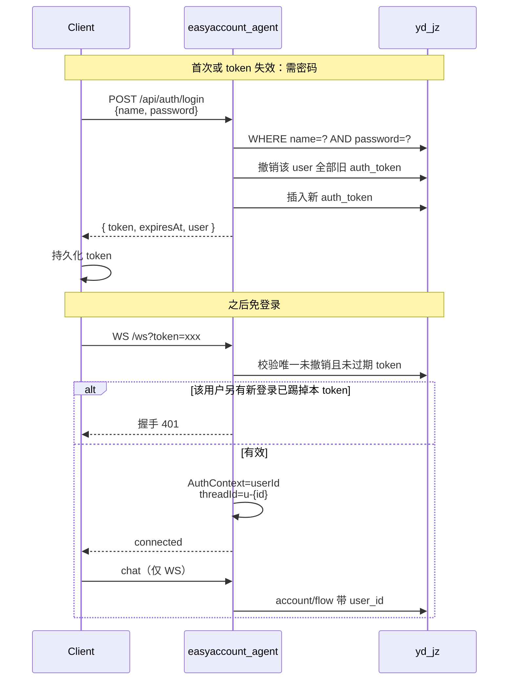

# 本地 user 表登录 + 免登录会话 + 多用户账本隔离

> **取代** [ws_登录鉴权集成_f66705ce.plan.md](ws_登录鉴权集成_f66705ce.plan.md)（user-center 方案已废弃）。

## 已确认约束（2026-07-14）

| 项 | 结论 |
|----|------|
| 身份源 | 本库 `user` 表，不调用 my-api |
| 表结构 | 见下节 DDL（`name` + `password int`） |
| 存量账本 | **直接清空**测试 `account`/`flow`，不做归属迁移 |
| 多端 | **禁止多端同时在线**；新登录撤销该用户全部旧 token |
| 对外通道 | **仅 WS 聊天**；不暴露 SSE（`GET /chat` 下线） |
| 免登录 | 长期 opaque token + `auth_token` 表；客户端持久化 |

---

## 1. 背景与目标

### 现状

- WS 信任客户端 `userId`，可 guest 匿名
- `account`/`flow` 无用户维度，账本全局共享
- 存在 `GET /chat` SSE，与「仅 WS」目标不符

### 目标

1. 用本地 `user` 登录，签发会话 token
2. 首次登录后凭 token 免输密码（最长约 30 天，可滑动续期）
3. 同一用户只允许一个有效会话（后登踢先登）
4. 账本按 `user_id` 严格隔离
5. 聊天只走 WebSocket

### 本阶段不做

- 注册 / 找回密码 / OAuth
- 用户自定义收支分类（`action`/`type` 仍全局）
- 将 `password` 从 `int` 升级为哈希（保持与现表兼容；安全加固另开迭代）

---

## 2. 总体架构



**HTTP 仅保留鉴权三件套**；业务对话与工具调用一律经 WS。

---

## 3. 数据模型

### 3.1 已确认：`user` 表

```sql
CREATE TABLE user
(
    id       INT AUTO_INCREMENT PRIMARY KEY,
    name     VARCHAR(50) NOT NULL,
    password INT         NOT NULL,
    CONSTRAINT user_id_uindex UNIQUE (id)
) COMMENT '用户表' CHARSET = utf8mb4;
```

| 列 | 映射 |
|----|------|
| `id` | 隔离主键 / `AuthContext.userId` |
| `name` | 登录名（登录 body 字段 `name`） |
| `password` | **整型**，比对时用 `Integer`/`int` 等值比较，**不做 BCrypt** |

Entity 示例字段：`Integer id; String name; Integer password;`

登录校验：

```text
SELECT id, name FROM user WHERE name = #{name} AND password = #{password}
```

无行 → 401「用户名或密码错误」（不区分哪边错）。

> 说明：`password` 为 int 来自现网表结构，本阶段兼容优先；后续若加固可另加列迁哈希，不在本次范围。

### 3.2 新增 `auth_token`（单端会话）

```sql
CREATE TABLE IF NOT EXISTS auth_token (
  id            BIGINT PRIMARY KEY AUTO_INCREMENT,
  user_id       INT          NOT NULL,
  token_hash    CHAR(64)     NOT NULL COMMENT 'SHA-256(hex) of raw token',
  expires_at    DATETIME     NOT NULL,
  created_at    DATETIME     NOT NULL,
  last_used_at  DATETIME     NULL,
  revoked       TINYINT      NOT NULL DEFAULT 0,
  user_agent    VARCHAR(255) NULL,
  UNIQUE KEY uk_token_hash (token_hash),
  KEY idx_user_id (user_id),
  KEY idx_expires (expires_at)
) COMMENT '单端登录会话；每用户仅允许一条未撤销有效记录';
```

**单端在线规则（硬约束）**：

1. `login` 成功时：`UPDATE auth_token SET revoked=1 WHERE user_id=? AND revoked=0`
2. 再插入新 token
3. 旧设备再用旧 token → 校验失败 → WS 握手 401 / `/api/auth/me` 401 → 客户端清本地 token 回登录页

可选加固（实现时可做）：表上不加 DB 唯一约束「每用户一条有效」，用事务内先撤后插即可，避免并发双插时靠应用层串行（同用户登录加短锁或 `SELECT ... FOR UPDATE` 亦可）。

**Token 策略**：

- 明文：32 字节随机 → Base64URL 发给客户端
- 库内：`SHA-256` 十六进制
- TTL：默认 **30 天**（`easyaccount.auth.token-ttl-days`）
- 滑动续期：剩余不足 **7 天** 时自动延长 30 天
- `logout`：当前 token `revoked=1`

### 3.3 账本隔离 + 清空测试数据

```sql
-- 清空测试账本（已确认可删）
DELETE FROM flow;
DELETE FROM account;

-- 隔离列
ALTER TABLE account
  ADD COLUMN user_id INT NOT NULL COMMENT '所属用户' AFTER id;
ALTER TABLE flow
  ADD COLUMN user_id INT NOT NULL COMMENT '所属用户' AFTER id;

CREATE INDEX idx_account_user ON account(user_id);
CREATE INDEX idx_flow_user ON flow(user_id);
```

脚本建议：`scripts/alter_auth_and_user_isolation.sql`（含 `auth_token` + 上列 + DELETE）。

`action` / `type`：**全局共享**，不加 `user_id`。

---

## 4. API 与通道

### 4.1 配置

```yaml
easyaccount:
  auth:
    enabled: ${EASYACCOUNT_AUTH_ENABLED:true}
    token-ttl-days: ${EASYACCOUNT_AUTH_TOKEN_TTL_DAYS:30}
    sliding-renew-days: ${EASYACCOUNT_AUTH_SLIDING_RENEW_DAYS:7}
```

### 4.2 仅暴露的 HTTP

| 方法 | 路径 | 鉴权 | 说明 |
|------|------|------|------|
| `POST` | `/api/auth/login` | 无 | body: `{ "name", "password" }`；password 为数字；成功踢掉旧会话 |
| `POST` | `/api/auth/logout` | Bearer | 撤销当前 token |
| `GET` | `/api/auth/me` | Bearer | 校验免登录态；附带滑动续期 |
| `GET` | `/health` | 无 | 探活保留 |

登录响应：

```json
{
  "token": "...",
  "expiresAt": "2026-08-13T02:00:00+08:00",
  "user": { "id": 1, "name": "rocky" }
}
```

### 4.3 WebSocket（唯一聊天入口）

- URL：`ws://host:8088/ws?token={token}`
- 握手失败（无 token / 无效 / 已被踢 / 过期）→ **HTTP 401**，不建连
- `threadId = "u-" + userId`
- **删除** query `userId` 与 guest 逻辑

### 4.4 下线 SSE

- 移除或禁用 [ChatController.java](src/main/java/com/rockyshen/easyaccountagent/controller/ChatController.java) 的 `GET /chat`
- 文档、README、deploy 示例删除 SSE 说明
- 验证：路径应 404 或不映射

### 4.5 AuthContext（WS worker）

```text
握手成功 → session attributes 存 AuthenticatedUser
收到 chat → 提交异步 worker 前捕获 userId
worker 内 AuthContext.set(userId) → Agent/Tools/DAO → finally clear
```

所有 Ledger 工具依赖 `AuthContext.requireUserId()`，禁止信任客户端乱传归属。

---

## 5. 多用户数据隔离

| 层 | 要点 |
|----|------|
| Entity | `Account`/`Flow` 增加 `userId` |
| DAO | 查询/更新/删除带 `user_id`；insert 写入当前用户 |
| Service | `findById(id, userId)`；跨用户返回空/业务错误 |
| Facade | 工具入参 accountId/flowId 必须属于当前用户 |

防 IDOR：用户 B 使用用户 A 的 `accountId` 调用 `addExpense` / `deleteAccount` → 失败。

信用卡额度逻辑不变，仅叠加 `user_id` 条件。

---

## 6. 客户端协议

**首次：**

1. `POST /api/auth/login` `{ name, password }` → 存 token  
2. `WS /ws?token=`

**免登录启动：**

1. 读本地 token → `GET /api/auth/me`  
2. 200 → 直接连 WS  
3. 401（含被其他端踢下线）→ 清 token → 登录页  

**登出：** `POST /api/auth/logout` + 清本地 token  

**被踢感知：** 旧端 WS 重连或心跳式 `/me` 收到 401 即可提示「已在其他设备登录」。

---

## 7. 关键决策摘要

| 决策 | 选择 |
|------|------|
| 登录字段 | `name` + `password`(int) 等值匹配 |
| 免登录 | opaque token + `auth_token`，TTL 30 天 + 滑动续期 |
| 单端 | 登录时撤销该用户全部旧 token |
| 存量数据 | `DELETE` 测试 account/flow 后加 `user_id NOT NULL` |
| 聊天通道 | 仅 WS；下线 SSE `/chat` |
| 分类 | action/type 全局共享 |

---

## 8. 实施顺序

1. DDL：`auth_token` + 清空 account/flow + 加 `user_id`
2. Auth 域：UserDao / AuthTokenDao / AuthService / 三个 HTTP 接口
3. WS 握手鉴权 + AuthContext（含异步）+ 去 guest
4. 下线 `GET /chat`
5. account/flow 全链路隔离
6. 文档与回归

---

## 9. 验证计划

1. 错误 `name`/`password` → 401  
2. 登录成功 → token；重启客户端仅凭 token 连 WS 成功  
3. 同一用户二次登录 → 旧 token `/me` 与 WS 均 401（**单端**）  
4. 登出后原 token 失效  
5. 用户 A 的账户对用户 B 不可见、不可写  
6. `GET /chat` 不可用  
7. 无 token / 伪造 token WS 握手 401  

---

## 10. 待办已关闭的确认项

- [x] `user` 表结构与密码类型（`int`）  
- [x] 存量账本：清空测试数据  
- [x] 不多端同时在线  
- [x] 不暴露 SSE，仅 WS  

可按本计划直接编码。
