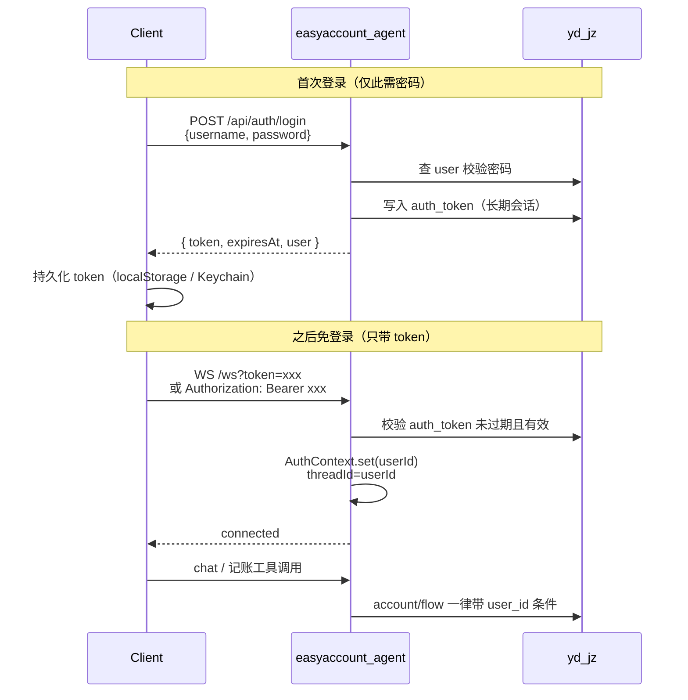

# 本地 user 表登录 + 免登录会话 + 多用户账本隔离

> **取代** [ws_登录鉴权集成_f66705ce.plan.md](ws_登录鉴权集成_f66705ce.plan.md)（原「调用 my-api Gateway / user-center 校验 JWT」方案作废，不再依赖外部平台）。

## 1. 背景与目标

### 现状问题

1. **无真实鉴权**：WS 从 query 读客户端自报 `userId`，缺省 `easyaccount-guest`。
2. **无数据隔离**：`account` / `flow` 查询无 `user_id`，所有连接共享同一账本。
3. **旧方案依赖外部系统**：调用 my-biz-platform `GET /api/user/current`，运维重、耦合高。

### 目标

| 目标 | 说明 |
|------|------|
| 本地登录 | 使用本库 `yd_jz.user` 校验用户名/密码，本服务自行签发会话 |
| 免重复登录 | 首次登录后客户端保存长期 token；之后连 WS / 调 API 只带 token，无需再输密码 |
| 多用户隔离 | 账户、流水按登录用户隔离；禁止跨用户读写 |
| 抛弃外部依赖 | 不调用 Gateway / user-center |

### 明确不做（本阶段）

- 手机验证码 / OAuth / 第三方登录
- 用户自助注册（可先仅支持库内已有用户登录；注册可后续加）
- 细粒度权限（管理员角色等）
- 密码找回

---

## 2. 总体架构



**核心原则**：密码只在登录接口出现一次；后续所有通道（WS、HTTP）只认本服务签发的会话 token。

---

## 3. 数据模型

### 3.1 `user` 表（已存在，实现前必须核验）

实现第一步：`DESCRIBE user;` / `SHOW CREATE TABLE user;`。

计划内按常见字段做**可替换假设**（以实表为准映射 Entity）：

| 假设字段 | 用途 |
|----------|------|
| `id` | 主键，整型；全库隔离键 |
| `username` / `u_name` / `account` | 登录名（以实列为准） |
| `password` | 密码（见下：哈希策略） |

**密码策略（需按现网数据决定）**：

- 若库内存的是明文或旧 App 自定义编码：登录时按现有规则校验，**不要擅自改成 BCrypt 导致老用户无法登录**；可在校验通过后异步升级哈希（可选后续项）。
- 若已是 BCrypt/同类哈希：直接用 `PasswordEncoder` 校验。

计划默认：先适配「现有可登录」；文档中写明实测结果。

### 3.2 新增 `auth_token`（会话表，支撑免登录）

```sql
CREATE TABLE IF NOT EXISTS auth_token (
  id            BIGINT PRIMARY KEY AUTO_INCREMENT,
  user_id       INT          NOT NULL,
  token_hash    CHAR(64)     NOT NULL COMMENT 'SHA-256(hex) of raw token',
  expires_at    DATETIME     NOT NULL,
  created_at    DATETIME     NOT NULL,
  last_used_at  DATETIME     NULL,
  revoked       TINYINT      NOT NULL DEFAULT 0,
  user_agent    VARCHAR(255) NULL,
  UNIQUE KEY uk_token_hash (token_hash),
  KEY idx_user_id (user_id),
  KEY idx_expires (expires_at)
) COMMENT '登录会话；客户端持有明文 token，库内只存哈希';
```

**为何用服务端会话表，而不是纯 JWT？**

| 方案 | 优点 | 缺点 |
|------|------|------|
| 仅长效 JWT（如 30 天） | 实现简单、无表 | 无法主动登出/踢下线；泄露只能等过期 |
| **opaque token + `auth_token` 表（推荐）** | 可登出、可踢多端、可滑迁过期 | 每次鉴权查一次库（可加短缓存） |

本项目体量小，**推荐 opaque token + 表**，完美支持「免登录 + 主动退出」。

**Token 生命周期建议**：

- 默认有效期：**30 天**（`easyaccount.auth.token-ttl-days`）
- 可选 **滑动续期**：鉴权成功且距过期 < 7 天时，自动把 `expires_at` 延长 30 天（免用户周期性重新登录）
- 登录接口参数 `rememberMe=true`（默认 true）：发长期 token；若 false 可用更短 TTL（如 1 天）给公共设备

**安全细节**：

- 发给客户端的是高熵随机串（如 32 bytes → Base64URL）
- 库内只存 `SHA-256(token)`，避免库泄露直接冒用
- 登出：`revoked=1`；可选「登出全部设备」按 `user_id` 批量撤销

### 3.3 账本隔离列

```sql
-- 若尚无 user_id，则追加（实现前先 SHOW COLUMNS 确认）
ALTER TABLE account ADD COLUMN user_id INT NULL COMMENT '所属用户' AFTER id;
ALTER TABLE flow    ADD COLUMN user_id INT NULL COMMENT '所属用户' AFTER id;
CREATE INDEX idx_account_user ON account(user_id);
CREATE INDEX idx_flow_user ON flow(user_id);
```

**存量数据迁移**（上线必做，二选一写进 deploy 清单）：

1. 指定一个「原机主」`user_id`，把现有 account/flow 全部归属给他；或
2. 若一人一库历史无需共用，直接 `UPDATE ... SET user_id = <adminId>`。

迁移后建议：`user_id` 改为 `NOT NULL`。

**分类字典**：`action` / `type` 默认仍**全局共享**（所有用户同一套收支分类）；若未来要自定义分类再按用户拆。

---

## 4. 鉴权与免登录设计

### 4.1 配置

```yaml
easyaccount:
  auth:
    enabled: ${EASYACCOUNT_AUTH_ENABLED:true}
    token-ttl-days: ${EASYACCOUNT_AUTH_TOKEN_TTL_DAYS:30}
    sliding-renew-days: ${EASYACCOUNT_AUTH_SLIDING_RENEW_DAYS:7}  # 剩余不足 N 天则续期
```

本地开发可 `enabled=false`，但生产默认开启；关闭时需在文档标明「仅开发，数据不隔离风险」。

### 4.2 HTTP API

| 方法 | 路径 | 说明 |
|------|------|------|
| `POST` | `/api/auth/login` | body: `{ username, password, rememberMe? }` → `{ token, expiresAt, user:{id,username} }` |
| `POST` | `/api/auth/logout` | Header Bearer；撤销当前 token |
| `GET` | `/api/auth/me` | 返回当前用户；无效 token → 401 |

成功登录响应示例：

```json
{
  "token": "opaque-random-string",
  "expiresAt": "2026-08-13T01:00:00+08:00",
  "user": { "id": 1, "username": "rocky" }
}
```

客户端：**首次保存 token**（Web: `localStorage`/`IndexedDB`；App: Keychain/SecureStore）。之后启动 App **先调 `/api/auth/me`**：

- 200 → 直接进主界面，WS 用该 token 连接（免登录）
- 401 → 跳登录页

### 4.3 Token 传递约定

与旧 user-center 方案类似的通道习惯，但 **token 含义变为本服务会话**：

1. Header：`Authorization: Bearer {token}`（HTTP / 能设头的客户端优先）
2. Query：`?token=`（浏览器 WebSocket 常用）

**废弃**：`?userId=` 客户端自报身份。

### 4.4 WebSocket

`WebSocketAuthHandshakeInterceptor`：

1. 提取 token（query → Header）
2. `AuthService.resolveUser(token)`：查 `auth_token` + join `user`；失败 → 握手 **401**
3. 成功：`attributes.put("authenticatedUser", user)`；可选滑动续期
4. `WebSocketHandler`：`threadId = "u-" + user.getId()`（Agent 会话记忆按用户隔离）
5. 删除 `resolveUserId` / guest 回落

### 4.5 REST / SSE（`GET /chat`）

增加同一套 Token 过滤器（或拦截器），避免只护住 WS、HTTP 仍裸奔。未登录不得查账/记账。

### 4.6 `AuthContext`

```text
Filter / WS Interceptor 校验通过后：
  AuthContext.setUserId(userId)
业务层（LedgerFacade / *Service / DAO）：
  一律读取 AuthContext.requireUserId()
请求结束：
  AuthContext.clear()
```

WS 场景注意：异步线程跑 Agent 时，要在提交到 worker 前 **捕获 userId 并传入**，或在 worker 开头 `AuthContext.set`，避免 ThreadLocal 丢上下文。

---

## 5. 多用户数据隔离（硬要求）

所有账本读写必须带当前 `userId`：

| 层 | 改动要点 |
|----|----------|
| `AccountDao` | `findByDisableFalse` → `WHERE user_id=#{userId} AND ...`；`findById` 增加 userId 条件 |
| `FlowDao` / `FlowSelectProvider` | 列表、详情、增删改均加 `user_id` |
| `AccountService` / `FlowService` | create 时写入 `user_id`；update/delete 前校验归属 |
| `LedgerFacade` 工具 | 不信任工具参数里的「他人账户 id」：先 `getOriginAccountById(id, userId)`，为空则拒绝 |

**防 IDOR 示例**：用户 A 不能对账户 id=B 的记录 `deleteAccount` / `addExpense`。

信用卡相关逻辑（可用额度、还款）保持不变，仅在查询/更新时叠加 `user_id`。

---

## 6. 代码落点（相对旧方案的替换关系）

| 旧方案（已废弃） | 新方案 |
|------------------|--------|
| `UserCenterAuthClient` 调 Gateway | `AuthService` + `UserDao` / `AuthTokenDao` 查本地库 |
| `MY_BIZ_GATEWAY_URL` | 删除；改为 `token-ttl-days` 等本地配置 |
| JWT 来自平台 | opaque session token 本服务签发 |
| `threadId=workNumber` | `threadId=u-{userId}` |
| 仅 WS 鉴权 | WS + HTTP 登录态 + 数据隔离 |

新建包建议：`com.rockyshen.easyaccountagent.auth` / `...entity.User` / `...dao.UserDao`。

涉及改造的现有文件（非穷尽）：

- [WebSocketHandler.java](src/main/java/com/rockyshen/easyaccountagent/controller/WebSocketHandler.java)
- [WebSocketConfig.java](src/main/java/com/rockyshen/easyaccountagent/config/WebSocketConfig.java)
- [ChatController.java](src/main/java/com/rockyshen/easyaccountagent/controller/ChatController.java)
- [AccountDao.java](src/main/java/com/rockyshen/easyaccountagent/dao/AccountDao.java) / [FlowDao.java](src/main/java/com/rockyshen/easyaccountagent/dao/FlowDao.java) / [FlowSelectProvider.java](src/main/java/com/rockyshen/easyaccountagent/dao/FlowSelectProvider.java)
- Account / Flow 实体与 Facade/Service 全链路
- [docs/easyaccounts-agent-usage.md](docs/easyaccounts-agent-usage.md)、deploy 环境变量示例

DDL 脚本建议放：`scripts/alter_auth_and_user_isolation.sql`。

---

## 7. 客户端协议（对接说明）

**首次：**

1. `POST /api/auth/login` → 存 `token`
2. `ws://host:8088/ws?token={token}`

**之后（免登录）：**

1. App 启动读本地 `token` → `GET /api/auth/me`
2. 有效则直接 `WS ?token=`，不出现登录页
3. 401 / 握手失败 → 清本地 token，回到登录页

**登出：**

1. `POST /api/auth/logout`（带 token）
2. 清除本地 token

旧协议 `ws://...?userId=xxx` **下线**。

---

## 8. 关键决策摘要

| 决策 | 选择 | 理由 |
|------|------|------|
| 身份源 | 本地 `user` 表 | 用户放弃 my-api user-center |
| 免登录 | 长期 opaque token + `auth_token` 表 | 可撤销、可滑动续期，比纯 JWT 更适合「登出」 |
| 鉴权时机 | WS Handshake + HTTP Filter | 未登录不建连、不入业务 |
| 隔离键 | `user.id` → `account.user_id` / `flow.user_id` | 真正多用户账本 |
| 分类字典 | action/type 仍全局 | 改动小；用户自定义分类留待后续 |
| 匿名 | 禁止 guest | 与隔离目标一致 |

---

## 9. 实施顺序

1. **核表**：`user` 字段、密码形态；`account`/`flow` 是否已有 `user_id`
2. **DDL**：`auth_token` + 隔离列 + 存量归属迁移
3. **Auth 域**：DAO / Service / login·logout·me API
4. **通道鉴权**：Filter + WS Interceptor + AuthContext（含异步传递）
5. **数据隔离**：DAO/Service/Facade 全链路加 `user_id`
6. **文档与回归**：双用户串数据、免登录续连、登出失效、过期 token

---

## 10. 验证计划

1. 错误密码登录 → 401，无 token
2. 正确登录 → 返回 token；杀进程重启客户端，仅用 token 连 WS 成功（**免登录**）
3. 登出后再用原 token 连 WS / 调 API → 401
4. 用户 A 创建账户后，用户 B 的 `listAccounts` **看不到** A 的账户
5. 用户 B 对 A 的 `accountId` 调用 `addExpense` / `deleteAccount` → 失败
6. 过期 token（或改库 `expires_at`）→ 401，需重新登录
7. 滑动续期：临近过期访问 `/me` 后 `expires_at` 延长
8. `EASYACCOUNT_AUTH_ENABLED=false` 仅开发可用，文档警告生产勿关

---

## 11. 风险与待确认清单

- [ ] `user` 表真实列名与密码存储格式（明文 / 自定义 / BCrypt）
- [ ] 现网是否已有多用户数据；存量 `user_id` 归属策略
- [ ] 是否允许多端同时在线（当前设计默认允许多 token；若要「单端登录」则登录时撤销该用户旧 token）
- [ ] `GET /chat` SSE 是否仍对外提供（若提供必须同源鉴权）

确认以上后即可按本计划编码；**旧 user-center 计划文件保留作废声明，不再实施。**
