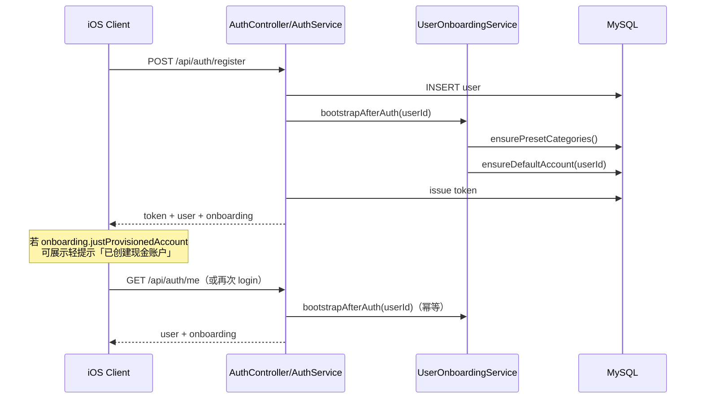

# 首次注册/登录：默认账户引导 + 预设分类校验

## 背景与问题

当前后端已具备：

- `POST /api/auth/register` → 只 `INSERT user` 后自动 `login`（见 `AuthService.register`）
- `account` / `flow` 按 `user_id` 隔离
- `action` / `type` **全局共享**，支持 CRUD，但**无种子数据、无启动校验**
- iOS 建议流程：`register/login → /me → 主页/聊天`（无 onboarding）

缺口：

1. 新用户账户列表为空 → Agent 记账需要 `accountId`，聊天首笔常失败
2. 分类正确性依赖运维手工维护的全局表；空库或被误删时，全员受影响
3. `/me` 仅返回 `{ id, name }`，客户端无法判断「是否需要引导」

## 目标

1. **首次注册（及存量空账户用户登录）后，用户至少有一个可用默认账户**
2. **全局预设分类（action + 最小 type 树）存在且可用**
3. **向客户端暴露轻量 onboarding 信号**，便于引导改名/补余额，而不是强制空白向导才能记账
4. **不引入** per-user 分类隔离（本阶段仍保持全局 `action`/`type`，与现网一致）

## 非目标（本阶段不做）

- 密码哈希、OAuth、多端会话
- `type.user_id` 多租户分类（可作为后续迭代）
- 复杂多步引导 UI（后端只提供信号 + 默认数据；具体弹窗由 iOS 实现）
- 自动创建多账户（微信/支付宝/信用卡等）——默认只建 **1 个普通账户**

---

## 产品决策（推荐方案）

| 决策点 | 推荐 | 理由 |
|--------|------|------|
| 默认账户何时创建 | **服务端自动创建**（幂等） | Agent-first：注册后立刻能记账；比纯前端引导更稳 |
| 客户端「引导」形态 | **轻确认，非强制向导** | 注册成功后提示「已为你创建账户『现金』，可改名或补余额」；可跳过 |
| 存量空账户用户 | **登录时同样 ensure** | 老用户登录也能补齐，避免只修注册路径 |
| 分类模型 | **继续全局共享 + 种子/校验** | 改动小；与 `docs/ios-swift-handoff.md` 一致 |
| 预设被删 | **启动/登录时补齐缺失项；保护系统项软删** | 避免全员分类空洞 |

备选（若产品坚持「必须用户亲手创建」）：

- 服务端不自动建账户，只返回 `needsAccountSetup=true`
- iOS 强制全屏「创建第一个账户」后才能进聊天  
代价：聊天链路与 Agent 空状态更复杂，不推荐作为默认。

---

## 推荐默认数据

### 默认账户

| 字段 | 值 |
|------|----|
| `aName` | `现金` |
| `accountType` | `0`（普通） |
| `money` | `"0.00"` |
| `exemptMoney` | `"0.00"` |
| `card` / `note` | 空 |
| `disable` | `false` |

说明：名称可用配置项 `easyaccount.onboarding.default-account-name` 覆盖，默认 `现金`。

### 预设 action（必须存在）

按 `handle` 幂等确保（不要死绑自增 id）：

| handle | hname |
|--------|-------|
| 0 | 收入 |
| 1 | 支出 |
| 2 | 转账 |

### 预设 type 树（最小可用集，可按产品微调）

按 **(action.handle, 父名, 子名)** 幂等创建，不依赖固定数字 id：

**支出 (handle=1)**

- 餐饮 → 早餐 / 午餐 / 晚餐 / 咖啡 / 外卖
- 交通 → 地铁 / 打车 / 加油
- 购物 → 日用 / 服装 / 数码
- 居住 → 房租 / 水电 / 物业
- 娱乐 → 电影 / 游戏 / 订阅
- 医疗 → 药品 / 诊疗
- 其他支出

**收入 (handle=0)**

- 工资 → 月薪 / 奖金
- 理财 → 利息 / 分红
- 其他收入

**转账 (handle=2)**

- 账户互转
- 信用卡还款（若 Agent `repayCreditCard` 依赖特定分类名，以现网工具约定为准，实现时对齐）

> 实现前用一次 `GET /api/actions` + `GET /api/types?actionId=` 对照现网数据，**以现网已有树为权威**，本清单只补缺失，不重命名已有节点。

---

## 总体流程



---

## 后端设计

### 1. `UserOnboardingService`（新）

路径建议：`com.rockyshen.easyaccountagent.service.UserOnboardingService`

```text
OnboardingResult bootstrapAfterAuth(int userId)
  ensurePresetCategories()      // 全局，短事务 / 可加轻量锁
  boolean created = ensureDefaultAccount(userId)
  return { hasAccounts, accountCount, defaultAccountId?, justProvisionedAccount, presetReady }
```

要点：

- **不要**依赖 `AuthContext`（register 时尚无拦截器上下文）；所有 DAO 调用显式传 `userId`
- `ensureDefaultAccount`：`accountDao.findByDisableFalse(userId)` 为空才插入；已有账户则跳过
- `ensurePresetCategories`：按 handle / 名称查找；缺失则 insert；已存在则不改名
- 注册与登录共用，保证幂等
- 失败策略：分类校验失败应打日志并反映到 `presetReady=false`；默认账户创建失败应让注册事务回滚（否则空账户用户会困惑）

### 2. 接入点

| 位置 | 改动 |
|------|------|
| `AuthService.register` | `userDao.insert` 成功后、`login` 前后调用 `bootstrapAfterAuth(user.getId())` |
| `AuthService.login` | 签发 token 前/后调用同一方法（覆盖存量空账户） |
| `AuthController` | login/register 响应附带 `onboarding`；可选 `/me` 也附带 |

建议响应扩展（向后兼容：旧客户端忽略未知字段）：

```json
{
  "token": "...",
  "expiresAt": "...",
  "user": { "id": 1, "name": "rocky" },
  "onboarding": {
    "hasAccounts": true,
    "accountCount": 1,
    "justProvisionedAccount": true,
    "defaultAccountName": "现金",
    "presetReady": true
  }
}
```

`/me`：

```json
{
  "id": 1,
  "name": "rocky",
  "onboarding": {
    "hasAccounts": true,
    "accountCount": 1,
    "justProvisionedAccount": false,
    "presetReady": true
  }
}
```

### 3. 账户创建实现细节

优先复用 `AccountDao.insert`，**不要**直接调 `AccountService.createAccount`（其内部 `AuthContext.requireUserId()`）。  
可二选一：

- A. `AccountService` 增加 `createAccountForUser(userId, ...)` 供 onboarding/内部使用  
- B. Onboarding 服务直接组装 `Account` 实体并 `insert`（更少改动，注意金额格式与 `AccountService` 一致）

推荐 **A**，避免两处创建逻辑分叉。

### 4. 预设分类落地方式

**推荐组合：**

1. **运行时幂等 ensure**（主路径）：`CategoryPresetService.ensureSystemPresets()`  
2. **可选 SQL 种子** `scripts/seed_preset_actions_types.sql`：给空库/运维一次性导入  
3. **启动时校验**（可选 `@PostConstruct` / `ApplicationRunner`）：日志告警缺失项；是否自动补齐与 `easyaccount.onboarding.auto-seed-presets=true` 配置绑定

查找策略（避免 id 漂移）：

- action：`WHERE handle = ?`；无则 insert
- type：在对应 action 下按 `tname` + `parent` 查找未停用节点；无则 insert

### 5. 系统预设保护（轻量）

全局分类下，误删会影响所有用户。建议：

- 给 `type` 增加可选列 `system_preset TINYINT DEFAULT 0`（或内存白名单：名称+handle）
- `TypeService.deleteType`：系统预设 → `400`「系统预设分类不可删除」
- 更新允许改名与否：建议 **允许改名但禁止删除**；或改名也禁止（更严）

若暂不想改 DDL：先用代码内白名单（handle + 固定名称）拦截删除，后续再加列。

### 6. Agent / Facade 兜底

- `easyaccounts-system.txt`：若 `listAccounts` 为空，先引导创建账户或告知已有默认账户可改名；禁止编造 accountId
- `LedgerFacade.listAccounts` 空文案保持友好，可提示「可说：新建一个微信账户」

默认账户自动创建后，空列表路径应极少触发。

---

## iOS 客户端配合（本仓库外，需文档约定）

更新 `docs/ios-swift-handoff.md`「App 启动流程」：

1. `register/login` 成功 → 读 `onboarding`
2. 若 `justProvisionedAccount == true`：Toast / 半屏卡片  
   「已为你创建『现金』账户，可在账户管理中改名或调整余额」  
   主按钮「知道了」/ 次按钮「去账户管理」
3. 若 `hasAccounts == false`（异常）：强制「创建第一个账户」页，调现有 `POST /api/accounts`
4. 若 `presetReady == false`：提示「分类数据未就绪，请稍后重试或联系管理员」，仍可进主页但慎开聊天
5. 正常路径：直接进主页/聊天，**不增加强制多步问卷**

---

## 配置项（可选）

```yaml
easyaccount:
  onboarding:
    default-account-name: 现金
    auto-seed-presets: true
    create-default-account-on-login: true   # 存量空账户补齐开关
```

---

## 测试计划

| 用例 | 期望 |
|------|------|
| 新用户 register | `GET /api/accounts` 恰好 1 个「现金」，余额 0.00 |
| 同一用户再 login | 不重复创建第二个默认账户 |
| 用户已有「微信」再 login | 不额外创建「现金」 |
| 空库启动 + ensure | action 三类齐全；最小 type 树可查 |
| 删除系统预设（若已保护） | 400 |
| 注册事务中账户 insert 失败 | 用户行回滚，无半成品用户 |
| 旧客户端忽略 onboarding 字段 | 仍可登录使用 |

单测优先 mock DAO；有条件再加 `@SpringBootTest` 集成。

---

## 实施顺序

1. **确认预设树与默认账户名**（对照现网 DB）
2. 实现 `CategoryPresetService` + SQL seed
3. 实现 `UserOnboardingService.ensureDefaultAccount` + `AccountService.createAccountForUser`
4. 接入 `AuthService.register` / `login`，扩展响应与 `/me`
5. 系统预设删除保护
6. Agent 提示微调
7. 单测 + 更新 `docs/ios-swift-handoff.md` / `docs/easyaccounts-agent-usage.md`

---

## 风险与后续

| 风险 | 缓解 |
|------|------|
| 全局分类被用户 CRUD 改乱 | 系统项保护 + ensure 只补不改 |
| 多用户并发首次 ensure 分类 | 按名称幂等；必要时对 seed 加短锁/唯一索引 |
| 「现金」名不符合用户习惯 | 客户端轻引导改名；Agent 支持 rename |
| 未来要做个人分类 | 新开迭代：`type.user_id` + 注册时 clone 模板；本方案 ensure 逻辑可迁到 per-user clone |

### 后续可选增强

- 注册时可选「常用账户包」：现金 + 微信 + 支付宝（仍服务端创建，一次勾选）
- `/api/onboarding/complete` 标记用户已看过引导（需 `user` 表加 flag）
- 将全局 type 迁为 per-user 模板复制（真正的多租户分类）

---

## 成功标准

- 新用户注册后无需手动建账户即可完成一笔记账（Agent 或 REST）
- 任意环境下 `GET /api/actions` 至少含收入/支出/转账；支出侧至少有一组常用一级分类
- iOS 能根据 `onboarding` 展示轻引导，且不阻塞主路径
- 存量空账户用户下一次 login 自动补齐默认账户
