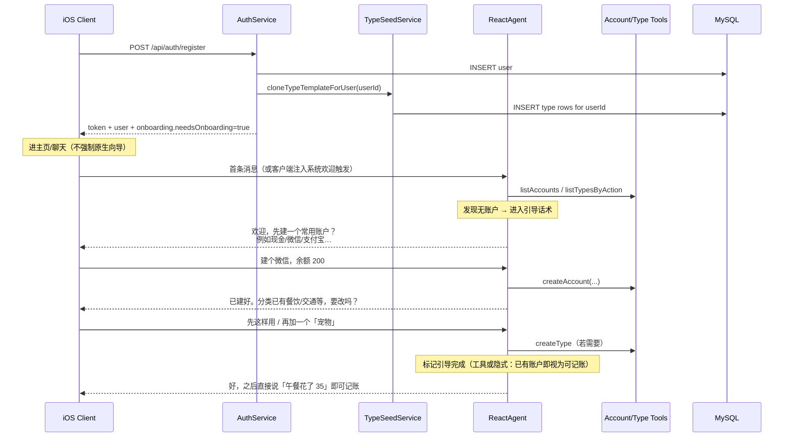

# 首次注册/登录：Agent 对话引导建账户 + 按用户隔离的预设分类

## 背景与问题

当前后端已具备：

- `POST /api/auth/register` → 只 `INSERT user` 后自动 `login`（见 `AuthService.register`）
- `account` / `flow` 按 `user_id` 隔离
- `action` / `type` **均为全局共享**；`TypeDao` 无 `user_id`，用户自定义分类会互相影响
- iOS：`register/login → /me → 主页/聊天`；无 onboarding
- Agent 具备 `createAccount` / `createType` / `listAccounts` / `listTypesByAction` 等工具，但系统提示未把「首次引导」当成一等流程

缺口：

1. 新用户无账户 → 直接记账会失败
2. `type` 全局共享 → 用户自定义/删除会污染其他人
3. 缺少「用对话完成首次设置」的产品路径

## 目标

1. **`action` 全局固定共用**（收入 / 支出 / 转账等），全员一致、不可被普通用户改乱
2. **`type` 按用户隔离**：每人一份分类树，可自由增删改，互不影响
3. **账户不由服务端静默创建**；由 **Agent 通过对话** 引导用户建立账户
4. **分类**：注册时可为用户 **克隆一份预设模板**（可改），再由 Agent 对话确认「是否沿用 / 要增删哪些」
5. 引导完成后，用户可正常记账；未完成时 Agent 优先推 onboarding，而不是硬拦 REST

## 非目标

- 密码哈希、OAuth、多端会话
- iOS 强制全屏向导（本阶段以 **聊天对话** 为主引导面）
- 服务端自动创建「现金」等默认账户（改为对话确认后由 Agent 调工具创建）
- 开放用户自定义 `action`（收支大类保持产品固定）

---

## 产品决策（已确认）

| 决策点 | 结论 | 说明 |
|--------|------|------|
| action | **全局共用、固定** | handle 0/1/2：收入 / 支出 / 转账；运维/启动 ensure |
| type | **按用户隔离** | `type.user_id`；CRUD / Agent 工具 / 流水引用均带用户维度 |
| 默认账户 | **不自动创建** | Agent 对话引导 → 用户确认名称/类型/余额 → `createAccount` |
| 预设分类 | **注册时克隆模板到该用户** | 克隆后用户可改；Agent 引导确认或微调 |
| 引导载体 | **Agent 对话** | 非 REST 静默、非强制原生多步表单 |
| 客户端 | 注册后进聊天即可 | `/me` 可带 `needsOnboarding` 供角标/首条欢迎，但不强制独立向导页 |

---

## 数据模型

### action（全局，不变）

| handle | hname |
|--------|-------|
| 0 | 收入 |
| 1 | 支出 |
| 2 | 转账 |

- 启动或运维脚本 `ensureGlobalActions()`：按 `handle` 幂等补齐
- 不对普通用户暴露删除/改名核心 action（若已有 `ActionController` 只读则保持只读）

### type（改为 per-user）

DDL 方向：

```sql
ALTER TABLE type
  ADD COLUMN user_id INT NULL COMMENT '所属用户；模板行可为 NULL 或迁到独立模板表';

-- 推荐：业务行必须归属用户
-- 方案 A：type_template 独立表存模板；type.user_id NOT NULL
-- 方案 B：type 中 user_id IS NULL 表示模板，业务查询始终带 user_id=当前用户
```

**推荐方案 A**（更清晰）：

| 表 | 用途 |
|----|------|
| `action` | 全局收支大类 |
| `type_template` | 产品预设分类树（无 user_id） |
| `type` | 用户分类；`user_id NOT NULL`；结构同现表 + `user_id` |

存量迁移：

1. 把现网全局 `type` 导出为 `type_template`（或标记为模板）
2. 已有用户：按模板 **各克隆一份** 到其 `user_id`（或仅对空分类用户克隆）
3. 历史 `flow.type_id`：若原先指向全局 id，迁移时需 **remap** 到该用户新克隆出的 type id（按名称/树路径映射）；无流水用户可直接清空旧全局引用

### 预设 type 模板（示例，实现前对照现网微调）

**支出**

- 餐饮 → 早餐 / 午餐 / 晚餐 / 咖啡 / 外卖
- 交通 → 地铁 / 打车 / 加油
- 购物 → 日用 / 服装 / 数码
- 居住 → 房租 / 水电 / 物业
- 娱乐 → 电影 / 游戏 / 订阅
- 医疗 → 药品 / 诊疗
- 其他支出

**收入**

- 工资 → 月薪 / 奖金
- 理财 → 利息 / 分红
- 其他收入

**转账**

- 账户互转
- 信用卡还款（与 Agent `repayCreditCard` 约定对齐）

---

## 总体流程（Agent 对话引导）



### 引导话术原则（写进 `easyaccounts-system.txt`）

1. 每次需要记账前：先 `listAccounts`；若为空 → **停止记账**，改为引导建账户  
2. 建账户：用自然语言确认 `名称`、`普通/信用卡`、`初始余额或额度` → 再 `createAccount`；禁止未经确认瞎建  
3. 账户建好后：`listTypesByAction` 展示当前（已克隆的）预设分类摘要，询问：  
   - 「先用这套」→ 进入正常记账  
   - 「加/改/删某某」→ 调 `createType` / `updateType` / `deleteType`（仅影响当前用户）  
4. 用户中途直接说「午餐 35」且已有账户与可匹配分类 → 正常记账；若无账户仍优先引导建账户  
5. 禁止暴露工具名与 ID；回复保持短句纯文本（沿用现有输出规范）

---

## 后端设计

### 1. Type 用户隔离（核心改造）

| 层 | 改动 |
|----|------|
| DDL | `type.user_id`；脚本 `scripts/alter_type_user_isolation.sql` |
| `Type` 实体 | 增加 `userId` |
| `TypeDao` | 所有查询/更新带 `user_id`（对齐 `AccountDao` 模式：`findById(id, userId)` 等） |
| `TypeService` | `AuthContext.requireUserId()`；create 写入 `userId`；delete/update 校验归属 |
| Agent 工具 / `LedgerFacade` | `listTypesByAction` / `createType` 等走隔离后的 Service |
| `FlowService` | 记账校验 `typeId` 必须属于当前用户（且 action 匹配） |

防 IDOR：禁止只按全局 `type.id` 读写。

### 2. 注册时克隆模板（不是静默建账户）

`TypeSeedService.cloneTemplateForUser(userId)`：

- 若该用户已有任意未停用 type → 跳过（幂等）
- 否则从 `type_template`（或代码内模板树）深拷贝二级树，写入 `type.user_id=userId`
- 在 `AuthService.register` 成功插入 user 后调用  
- **login 不自动建账户**；login 仅可对「完全没有 type 的存量用户」补一次 clone（可选开关）

### 3. Onboarding 状态（给 Agent / 可选给客户端）

扩展 `/me` 与 login/register 响应（旧客户端忽略未知字段）：

```json
{
  "id": 1,
  "name": "rocky",
  "onboarding": {
    "needsOnboarding": true,
    "hasAccounts": false,
    "hasTypes": true,
    "typesSeeded": true
  }
}
```

判定建议：

- `hasTypes`：该用户存在未停用 type  
- `hasAccounts`：该用户存在未停用 account  
- `needsOnboarding`：`!hasAccounts`（分类已种子但仍需对话建账户；若也要强制确认分类，可另加 `typesConfirmed` flag）

是否落库 `user.onboarding_completed`：

- **最小方案**：不落库，用 `hasAccounts` 推断即可  
- **增强方案**：Agent 引导结束时调 `completeOnboarding` 工具写 flag，避免用户删光账户后又强制完整引导

推荐先做最小方案；若产品要「分类确认」步骤，再加 `types_confirmed`。

### 4. 不自动创建默认账户

- **删除**此前方案中的 `ensureDefaultAccount` / 注册时 insert「现金」
- 账户只通过：
  - Agent `createAccount`（对话确认后），或
  - 用户在侧栏 REST `POST /api/accounts`（高级用户可跳过对话）
- Agent 在无账户时必须引导，不能编造 `accountId`

### 5. action 全局 ensure

`CategoryPresetService.ensureGlobalActions()`：

- 启动时或运维 SQL：保证 handle 0/1/2 存在
- 与 type 模板分离：模板只引用 action id/handle，不复制 action 行

### 6. Agent / Prompt / Facade

| 项 | 内容 |
|----|------|
| `easyaccounts-system.txt` | 增加「首次使用 / 无账户」对话引导流程（见上） |
| `LedgerFacade.listAccounts` | 空列表文案暗示可说「帮我建一个微信账户」 |
| 可选工具 `getOnboardingStatus` | 返回 hasAccounts/hasTypes，减少模型误判 |
| 可选工具 `completeOnboarding` | 仅在有增强 flag 时需要 |

### 7. iOS 配合（轻量）

- 注册/登录后：**直接可进聊天**；首条可由客户端发隐藏 trigger（如「开始使用」）或展示欢迎气泡引导用户说话  
- 若 `needsOnboarding=true`：可选在聊天置顶提示「先和助手聊聊，建个账户吧」——**不是**独立强制表单  
- 侧栏账户/分类管理仍可用；分类列表变为「当前用户自己的树」  
- 更新 `docs/ios-swift-handoff.md`：明确 `type` 已按用户隔离；`action` 仍全局

---

## 配置项（可选）

```yaml
easyaccount:
  onboarding:
    clone-types-on-register: true
    clone-types-on-login-if-empty: true   # 存量用户补种子
    # 不再提供 auto-create-default-account
```

---

## 测试计划

| 用例 | 期望 |
|------|------|
| 新用户 register | 无账户；有一套克隆自模板的 type；`needsOnboarding=true` |
| 用户 A 改/删 type | 用户 B 的 type 不变 |
| 用户 A 的 typeId 被用户 B 用于记账 | 失败（隔离） |
| Agent：无账户时用户说「午餐 35」 | 不落账，改为引导建账户 |
| Agent：用户确认「建微信余额 200」 | 调用 createAccount 成功 |
| Agent：用户说「先用默认分类」 | 进入可记账状态；不误改他人数据 |
| 全局 action 缺失时启动 ensure | 补齐收入/支出/转账 |
| 同一用户重复 login | 不重复克隆第二套 type |
| REST `GET /api/types?actionId=` | 只返回当前用户分类 |

---

## 实施顺序

1. **确认模板树** + 存量 `flow.type_id` 迁移策略  
2. DDL：`type.user_id` + `type_template`（或等价）  
3. `TypeDao` / `TypeService` / Flow 校验 / Agent 工具隔离  
4. `TypeSeedService`：注册克隆；可选 login 补种  
5. `ensureGlobalActions`  
6. 改写 `easyaccounts-system.txt` 对话引导；必要时加 `getOnboardingStatus`  
7. 扩展 `/me` onboarding 字段；**不**做静默默认账户  
8. 单测 + 文档（iOS handoff / usage）

---

## 风险与缓解

| 风险 | 缓解 |
|------|------|
| 存量 flow 指向旧全局 type id | 迁移脚本按用户 remap；或维护期清空测试账本（若环境允许） |
| Agent 未引导就尝试记账 | Prompt 硬规则 + listAccounts 为空时工具/Facade 拒绝写入并返回引导提示 |
| 用户跳过聊天只用 REST | 允许；侧栏仍可建账户/改分类；与对话引导并存 |
| 模板过胖/过瘦 | 模板可配置；对话中支持增删 |
| 克隆性能 | 模板体量小（几十行）；单次注册一次写入可接受 |

---

## 成功标准

- 不同用户各自维护 type，互不可见、互不可改  
- `action` 仍为全局固定的收入/支出/转账  
- 新用户注册后 **没有** 自动账户，但有一份个人预设分类  
- 用户通过与 Agent 对话即可完成：建账户 → 确认/微调分类 → 第一笔记账  
- iOS 无需强制原生向导即可完成首次设置
